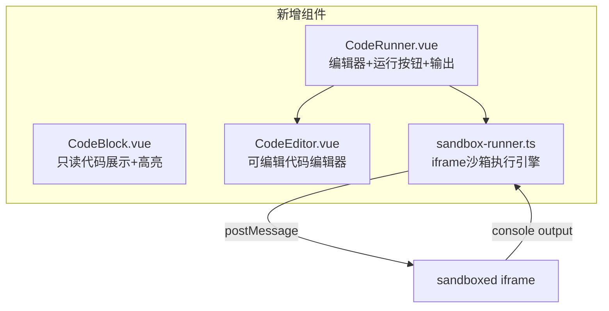

# 引入 CodeMirror 代码编辑器与安全运行环境

## 问题分析

1. **显示异常**：[QAQuestion.vue](src/components/QAQuestion.vue) 第 15 行用 `{{ item.q }}` 渲染问题文本，导致 HTML（`<pre>`、`<br/>`）被转义显示为原始标签文本
2. **缺少代码高亮**：题目中的代码片段无语法高亮，阅读体验差
3. **缺少在线运行**：候选人目前只能在文件中改代码，无法在页面上直接编写和运行

## 架构设计




## 依赖安装

```bash
npm install vue-codemirror6 codemirror @codemirror/lang-javascript @codemirror/lang-css @codemirror/lang-html @codemirror/theme-one-dark
```

## 实现步骤

### 第一步：修复 QA 问题文本的 HTML 显示

修改 [src/components/QAQuestion.vue](src/components/QAQuestion.vue) 第 15 行，将 `{{ item.q }}` 改为 `v-html="item.q"`，使问题中的代码块正常渲染。

### 第二步：创建 CodeBlock 只读代码展示组件

`src/components/CodeBlock.vue` -- 基于 vue-codemirror6 封装的只读代码展示组件：

- Props: `code`（代码字符串）、`lang`（语言，默认 javascript）
- 特性：语法高亮、行号、只读、暗色主题

用途：替换 QA 题目中的 `<pre>` 代码块（如事件循环的输出题）。

### 第三步：创建 CodeEditor 可编辑组件

`src/components/CodeEditor.vue` -- 可编辑的代码编辑器：

- Props: `modelValue`（v-model 双向绑定）、`lang`、`readonly`、`placeholder`
- 特性：语法高亮、行号、自动补全提示、暗色/亮色主题

### 第四步：创建 sandbox-runner 安全执行引擎

`src/utils/sandbox-runner.ts` -- 使用 sandboxed iframe 执行用户代码：

- 创建 `<iframe sandbox="allow-scripts">` 隔离环境
- 拦截 `console.log/warn/error` 输出
- 通过 `postMessage` 通信
- 3 秒超时保护，防止死循环
- 返回执行结果和控制台输出

### 第五步：创建 CodeRunner 组合组件

`src/components/CodeRunner.vue` -- 组合编辑器 + 运行 + 输出：

- 上方：CodeEditor（可编辑代码）
- 中间：运行按钮 + 重置按钮
- 下方：控制台输出面板（展示 console.log 结果）
- Props: `initialCode`（初始代码/模板）、`lang`

### 第六步：改造现有题目页面

**QA 题目 -- 用 CodeBlock 替换 pre 标签：**

- [EventLoop.vue](src/views/javascript/EventLoop.vue)：4 道输出题的代码用 CodeBlock 高亮展示
- [PrototypeChain.vue](src/views/javascript/PrototypeChain.vue)：代码示例用 CodeBlock
- [Vue3VsVue2.vue](src/views/vue3/Vue3VsVue2.vue)：代码对比用 CodeBlock
- [VirtualDom.vue](src/views/vue3/VirtualDom.vue)：VNode 示例用 CodeBlock

**代码题 -- 增加 CodeRunner 在线编写+运行：**

- [ArrayMethods.vue](src/views/javascript/ArrayMethods.vue)：增加 CodeRunner 区域，候选人可以在页面上直接编写数组操作代码并运行
- [ObjectMethods.vue](src/views/javascript/ObjectMethods.vue)：同上
- [ES6Features.vue](src/views/javascript/ES6Features.vue)：let/var/const 区别、解构等可在线运行
- [ClosureScope.vue](src/views/javascript/ClosureScope.vue)：闭包陷阱可在线运行验证
- [ThisBinding.vue](src/views/javascript/ThisBinding.vue)：this 指向场景可在线运行
- [CallApplyBind.vue](src/views/javascript/CallApplyBind.vue)：手写实现可在线测试

每个题目保留原有的 TODO 文件编辑方式，CodeRunner 作为**额外的在线练习区**，两种方式并存。

## 文件变更总览

```
新增:
  src/components/CodeBlock.vue        -- 只读代码高亮展示
  src/components/CodeEditor.vue       -- 可编辑代码编辑器
  src/components/CodeRunner.vue       -- 编辑器+运行+输出面板
  src/utils/sandbox-runner.ts         -- iframe 沙箱执行引擎

修改:
  package.json                        -- 新增 codemirror 相关依赖
  src/components/QAQuestion.vue       -- q 字段改用 v-html
  src/views/javascript/EventLoop.vue  -- pre 改为 CodeBlock
  src/views/javascript/PrototypeChain.vue
  src/views/vue3/Vue3VsVue2.vue
  src/views/vue3/VirtualDom.vue
  src/views/javascript/ArrayMethods.vue    -- 增加 CodeRunner
  src/views/javascript/ObjectMethods.vue
  src/views/javascript/ES6Features.vue
  src/views/javascript/ClosureScope.vue
  src/views/javascript/ThisBinding.vue
  src/views/javascript/CallApplyBind.vue
```

