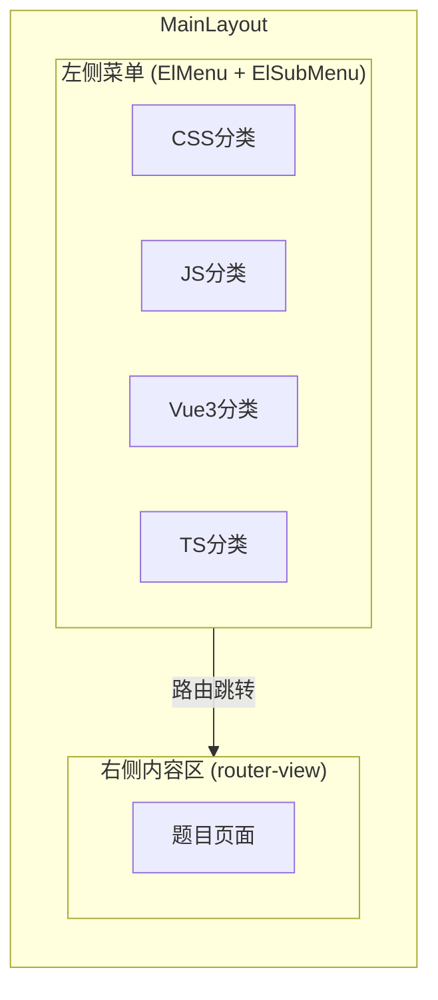

# 现场面试考察项目

## 技术栈与版本

- **Vue**: ^3.5.13
- **Vite**: ^6.2.0（6.x 稳定版，8.0 刚发布一周风险较高）
- **Element Plus**: ^2.13.5
- **Vue Router**: ^4.5.0
- **TypeScript**: ^5.7.0

使用 `npm create vite@latest` 脚手架初始化，然后手动安装 Element Plus 和 Vue Router。

## 项目目录结构

```
ko-interview/
├── src/
│   ├── layouts/
│   │   └── MainLayout.vue            # 主布局：左侧菜单 + 右侧内容
│   ├── router/
│   │   └── index.ts                  # 路由配置（按分类嵌套）
│   ├── config/
│   │   └── questions.ts              # 题目元数据配置（标题、分类、类型）
│   ├── components/
│   │   ├── QuestionCard.vue          # 题目容器组件（标题+描述+类型标签）
│   │   └── QAQuestion.vue            # QA 题目通用组件
│   ├── views/
│   │   ├── HomeView.vue              # 欢迎首页
│   │   ├── css/                      # CSS 题目（5 题）
│   │   ├── javascript/               # JS 题目（7 题）
│   │   ├── vue3/                     # Vue3 题目（6 题）
│   │   └── typescript/               # TS 题目（3 题）
│   ├── App.vue
│   ├── main.ts
│   └── styles/
│       └── variables.css
├── index.html
├── package.json
├── tsconfig.json
└── vite.config.ts
```

## 页面布局




- **左侧**：ElMenu + ElSubMenu 按分类折叠，每个题目显示类型标签（代码题/问答题）
- **右侧**：`<router-view>` 渲染对应题目页面
- 布局比例约 240px 侧边栏 + 剩余自适应

## 题目设计（共 21 题）

### CSS 分类（5 题）


| 序号  | 题目          | 类型  | 考察点                                   |
| --- | ----------- | --- | ------------------------------------- |
| 1   | 水平垂直居中      | 代码题 | flex / grid / transform / margin 多种实现 |
| 2   | Flex 弹性布局   | 代码题 | 经典三栏布局：左右固定宽度，中间自适应                   |
| 3   | CSS 选择器与优先级 | 问答题 | 选择器权重计算、!important、继承                 |
| 4   | 盒模型与 BFC    | 问答题 | content-box vs border-box、BFC 触发与应用   |
| 5   | CSS 过渡与动画   | 代码题 | transition / animation / keyframes    |


### JavaScript 分类（7 题）


| 序号  | 题目                    | 类型  | 考察点                                         |
| --- | --------------------- | --- | ------------------------------------------- |
| 1   | 数组常用方法                | 代码题 | map / filter / reduce / find / some / every |
| 2   | 对象常用方法                | 代码题 | keys / values / entries / assign / 展开运算符    |
| 3   | Promise 与 async/await | 代码题 | 串行/并行异步、错误处理、Promise.all/race               |
| 4   | 闭包与作用域                | 代码题 | 闭包原理、应用场景（计数器/缓存）                           |
| 5   | 事件循环                  | 问答题 | 宏任务/微任务执行顺序、输出题                             |
| 6   | 手写防抖与节流               | 代码题 | debounce / throttle 实现                      |
| 7   | 深拷贝实现                 | 代码题 | 递归实现、循环引用处理                                 |


### Vue3 分类（6 题）


| 序号  | 题目               | 类型  | 考察点                             |
| --- | ---------------- | --- | ------------------------------- |
| 1   | ref 与 reactive   | 代码题 | 响应式声明、.value、toRefs             |
| 2   | computed 与 watch | 代码题 | 计算属性 vs 侦听器使用场景                 |
| 3   | 组件通信             | 代码题 | props / emit / provide / inject |
| 4   | 生命周期             | 问答题 | 各钩子执行时机、与 Vue2 对比               |
| 5   | 自定义指令            | 代码题 | directive 定义与使用                 |
| 6   | 插槽               | 代码题 | 默认/具名/作用域插槽                     |


### TypeScript 分类（3 题）


| 序号  | 题目      | 类型  | 考察点                                       |
| --- | ------- | --- | ----------------------------------------- |
| 1   | 基础类型与接口 | 代码题 | type / interface / 联合类型 / 交叉类型            |
| 2   | 泛型      | 代码题 | 泛型函数 / 泛型约束 / 常用工具类型                      |
| 3   | 类型体操基础  | 问答题 | Partial / Required / Pick / Omit / Record |


## 每道题的页面结构

每个题目是一个独立的 `.vue` SFC，使用 `QuestionCard` 组件包裹：

- **题目标题** + **类型标签**（代码题 / 问答题）
- **题目描述**：清晰说明要求
- **代码题**：包含 `<!-- TODO: 请在此处编写你的代码 -->` 标注的待实现区域，候选人直接在文件中编写代码，页面实时展示效果
- **问答题**：列出问题要点，供面试官与候选人口头讨论，使用折叠面板放置参考答案

## 实现步骤

### 第一阶段：项目初始化

1. 使用 Vite 创建 Vue 3 + TS 项目
2. 安装 Element Plus、Vue Router
3. 配置 Element Plus 自动导入
4. 搭建主布局 `MainLayout.vue`

### 第二阶段：路由与侧边栏

1. 在 `config/questions.ts` 定义题目元数据
2. 配置路由（按分类嵌套）
3. 实现侧边栏菜单（根据元数据自动生成）

### 第三阶段：通用组件

1. `QuestionCard.vue` — 题目容器
2. `QAQuestion.vue` — 问答题模板

### 第四阶段：CSS 题目页面（5 个）

### 第五阶段：JavaScript 题目页面（7 个）

### 第六阶段：Vue3 题目页面（6 个）

### 第七阶段：TypeScript 题目页面（3 个）

### 第八阶段：首页与收尾

1. 欢迎首页设计
2. 全局样式优化
3. README 更新

