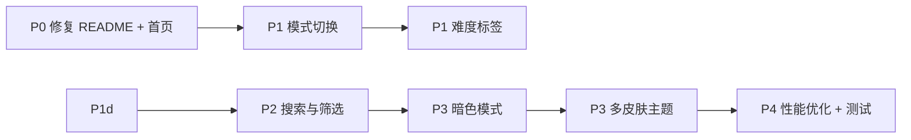

# 项目下一步规划

## 现状分析

项目已有 73 题、13 分类，具备 CodeRunner/CssRunner 在线编码能力。但目前更像是一个**题库展示工具**，缺少面试实战中需要的功能。以下按优先级从高到低排列。

---

## P0 - 立即修复

### 1. README 严重过时

README 仍写"共 29 题"，只列出 4 个分类。需要更新为 73 题、13 分类的完整列表。

### 2. HomeView 首页增强

首页虽然动态计算了统计数据，但只展示了原始 4 个分类的卡片布局。13 个分类用 `el-row :span="6"` 会溢出。需要改为自适应网格或更紧凑的统计展示。

---

## P1 - 面试实战体验（最有价值）

### 3. 面试官模式 vs 候选人模式

当前参考答案始终可见，候选人一眼就能看到。需要增加**模式切换**：

- **候选人模式**：隐藏所有参考答案的折叠面板，只显示题目
- **面试官模式**：显示参考答案 + 评分工具
- 通过顶部开关或 URL 参数控制（如 `?mode=candidate`）

### 4. 难度标签

73 题没有难度区分，面试官不知道哪些适合初级、哪些适合高级。为每道题增加难度标签：

- Question 接口增加 `difficulty: 'easy' | 'medium' | 'hard'`
- 侧边栏和题目页显示难度标签（绿/橙/红）
- 支持按难度筛选

---

## P2 - 搜索与筛选

### 5. 题目搜索与筛选

73 题找起来慢。增加搜索和筛选功能：

- 侧边栏顶部增加搜索框（模糊匹配题目标题）
- 支持按题型（代码/问答）、难度、分类联合筛选
- 搜索结果高亮匹配关键词

---

## P3 - 视觉与体验

### 6. 暗色模式

增加 Dark Mode 支持：

- Element Plus 内置暗色主题（`el-config-provider`）
- 顶部增加主题切换按钮
- CodeMirror 已使用 oneDark 主题，需要亮色备选

### 7. 多皮肤主题，改成默认Hero系统风格

新增以下两个皮肤主题：

- 一种是仿apple ios 的主题风格皮肤 Apple
- 一种是仿英雄联盟最新客户端主题风格皮肤 Hero
- 顶部增加主题切换按钮
- CodeMirror 已使用 oneDark 主题，需要亮色备选

---

## P4 - 工程质量

### 8. 性能优化

当前打包体积 ~1.6MB（gzip ~530KB），Element Plus 全量引入是主因：

- Element Plus 改为按需引入（已配置 unplugin 但 main.ts 仍全量 import）
- CodeMirror chunk 577KB，考虑动态导入
- 路由懒加载已做，但可加 loading 骨架屏

### 9. 单元测试

项目无任何测试。至少需要：

- 组件测试：QuestionCard / QAQuestion / CodeRunner
- 工具测试：sandbox-runner.ts
- 配置验证：questions.ts 和 router 的一致性检查

---

## 建议实施顺序

**预计工作量**：P0 约 30 分钟，P1 约 3-4 小时，P2 约 1 小时，P3 约 2 小时，P4 约 2-3 小时。
